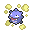

# Koffing

Koffing is a Pokemon Showdown Team parser that converts your strategies to
machine-readable JSON code.

 🔁

[Pokémon Showdown](https://www.pokemonshowdown.com/) is the most popular online Pokémon battle simulator,
one of the best ways to quickly try your strategies for the official Pokémon VGC Championships. This library is just
a parser for the teams generated by the [Showdown Team Builder](https://play.pokemonshowdown.com/teambuilder) exports.

This repository holds the source code for the library as well as the code for the Online Parser.
The [Online Parser](https://itsjavi.github.io/koffing) does not require you to download
any library or script, it is recommended if all you want is to sanitize, prettify or convert to JSON your
Showdown team exports.

## Features

- Compatible with web browsers and NodeJS, including ES6+ imports
- Converts from Showdown code to JSON
- Converts from JSON to Showdown code
- Sanitizes Showdown code (removing invalid data, applying max and mins values, etc.)
- Prettifies Showdown code (proper indentation, line breaks and sorting of the data, etc.)
- [Online Parser](https://itsjavi.github.io/koffing), which is using the library
  featuring all the above mentioned.

## Installation

As a package:

```bash
npm i --save koffing
```

In the browser, using a CDN:

```html
<script src="https://cdn.rawgit.com/itsjavi/koffing/0.4.0/dist/koffing.min.js"></script>
```

## Usage

### Javascript (ES5, web)

```html
<script src="dist/koffing.min.js"></script>
<script>
  var teamCode = `=== [gen7] Folder 1/Example Team ===`
  var parsedTeam = Koffing.parse(teamCode)
  console.log(parsedTeam)

  // Note that the ShowdownParser class, which is used internally by the Koffing class
  // is also exposed in the global scope:
  console.log(new ShowdownParser(teamCode).parse())
</script>
```

### Javascript (ES6+, universal)

```js
'use strict'

import { Koffing } from 'koffing'

const teamCode = `
=== [gen7] Folder 1/Example Team ===

Smogon (Koffing) (F) @ Eviolite
Level: 5
Ability: Levitate
Shiny: Yes
Happiness: 255
EVs: 36 HP / 236 Def / 236 SpD
IVs: 31 HP / 30 Atk / 31 SpA / 30 SpD / 31 Spe
Bold Nature
- Will-O-Wisp
- Pain Split
- Sludge Bomb
- Fire Blast`

let parsedTeam = Koffing.parse(teamCode)

// This will log a PokémonTeamSet object:
console.log(parsedTeam)
// Convert it back to the Showdown format (prettified):
console.log(parsedTeam.toShowdown())
// which is the same as:
console.log(parsedTeam.toString())
// and the same as:
console.log(parsedTeam + '')
// You can also convert the object to JSON:
console.log(parsedTeam.toJson())
// which is the same as:
console.log(Koffing.toJson(teamCode))
```

### NodeJS

```js
const Koffing = require('koffing').Koffing

const teamCode = `=== [gen7] Folder 1/Example Team ===`
let parsedTeam = Koffing.parse(teamCode)
console.log(parsedTeam)
```

## Class Reference

The `Koffing` class is basically a wrapper of the `ShowdownParser` class, the difference is that it can be used statically.

`ShowdownParser` class methods:

- `parse(): PokemonTeamSet`: Parses the Showdown code and returns a `PokemonTeamSet` object.
- `format(): String`: Parses the Showdown code and returns a prettified and sanitized version of it.
- `toString(): String`: Basically returns the internal Showdown code string as it is.

`Koffing` class methods:

- `static parse(showdownCode): PokemonTeamSet`: Wrapper for `ShowdownParser.prototype.parse()`
- `static format(showdownCode): String`: Wrapper for `ShowdownParser.prototype.format()`
- `static toJson(showdownCode): String`: Wrapper for `ShowdownParser.prototype.parse().toJson()`
- `static toShowdown(jsonCode): String`: Wrapper for `ShowdownParser.prototype.parse().toShowdown()`

## React App

This project was bootstrapped with [Create React App](https://github.com/facebook/create-react-app).

### Available Scripts

In the project directory, you can run:

#### `yarn start`

Runs the app in the development mode.<br />
Open [http://localhost:3000](http://localhost:3000) to view it in the browser.

The page will reload if you make edits.<br />
You will also see any lint errors in the console.

#### `yarn test`

Launches the test runner in the interactive watch mode.<br />
See the section about [running tests](https://facebook.github.io/create-react-app/docs/running-tests) for more information.

#### `yarn build`

Builds the app for production to the `build` folder.<br />
It correctly bundles React in production mode and optimizes the build for the best performance.

The build is minified and the filenames include the hashes.<br />
Your app is ready to be deployed!

See the section about [deployment](https://facebook.github.io/create-react-app/docs/deployment) for more information.

#### `yarn eject`

**Note: this is a one-way operation. Once you `eject`, you can’t go back!**

If you aren’t satisfied with the build tool and configuration choices, you can `eject` at any time. This command will remove the single build dependency from your project.

Instead, it will copy all the configuration files and the transitive dependencies (webpack, Babel, ESLint, etc) right into your project so you have full control over them. All of the commands except `eject` will still work, but they will point to the copied scripts so you can tweak them. At this point you’re on your own.

You don’t have to ever use `eject`. The curated feature set is suitable for small and middle deployments, and you shouldn’t feel obligated to use this feature. However we understand that this tool wouldn’t be useful if you couldn’t customize it when you are ready for it.

### Learn More

You can learn more in the [Create React App documentation](https://facebook.github.io/create-react-app/docs/getting-started).

To learn React, check out the [React documentation](https://reactjs.org/).

## License

This software is copyrighted and licensed under the
[MIT license](https://github.com/itsjavi/koffing/LICENSE).

### Disclaimer

This software comes bundled with data and graphics extracted from the
Pokémon series of video games. Some terminology from the Pokémon franchise is
also necessarily used within the software itself. This is all the intellectual
property of Nintendo, Creatures, inc., and GAME FREAK, inc. and is protected by
various copyrights and trademarks.

The authors believe that the use of this intellectual property for a fan reference
is covered by fair use and that the software is significantly impaired without said
property included. Any use of this copyrighted property is at your own legal risk.

This software is not affiliated in any way with Nintendo,
Pokémon or any other game company.

A complete revision history of this software is available from
https://github.com/itsjavi/koffing
